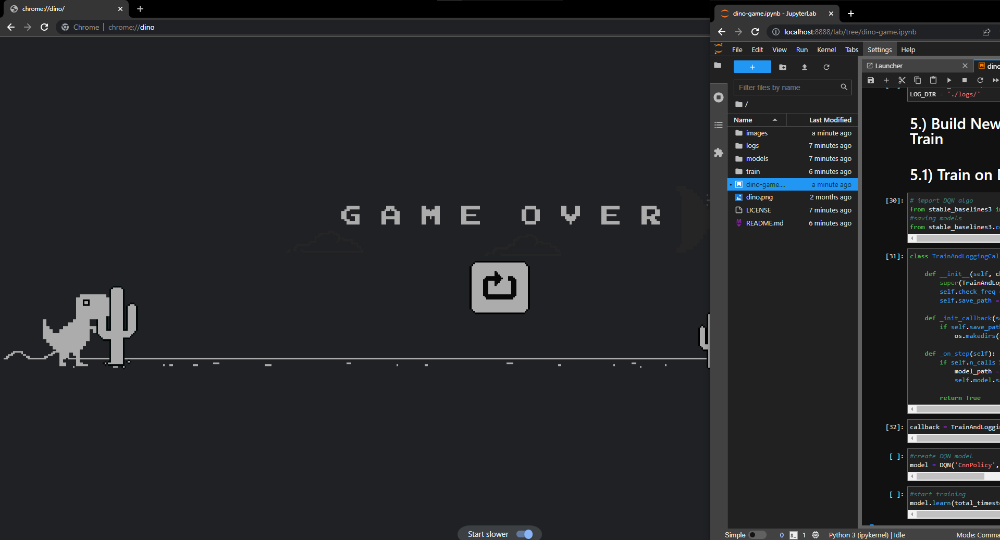

# ai-dino-game
Custom AI model trained on stable-baslines3 DQN and PPO algortihims to play google chromes dinosaur game. 

To start the model, download the repository and run through steps 1-3 on the `dino-game.ipynb` file. For steps 4-7, you have to create another window in which the chrome dinosaur game takes up the majority of the screen and the jupyter-notebook only takes up right part of it, similar to the image below. Once your screen is in position, you can start training or can start testing out the model. 

